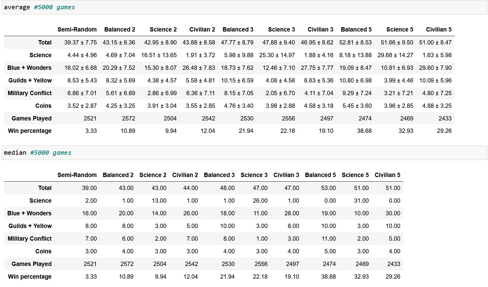
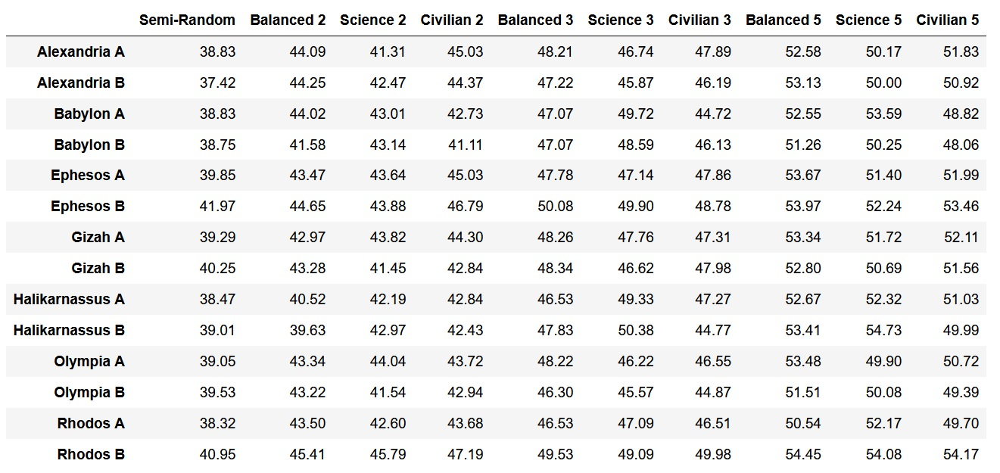
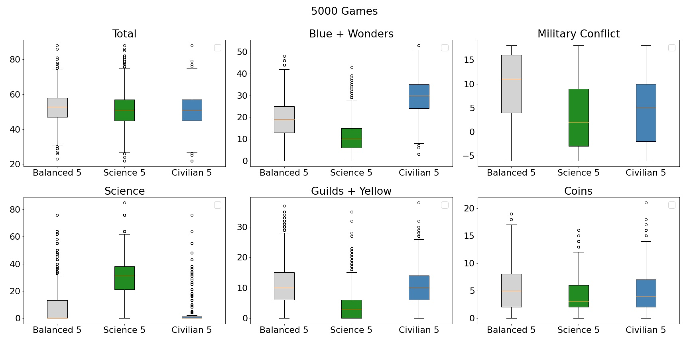
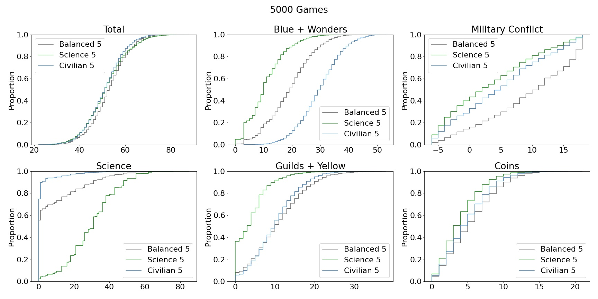
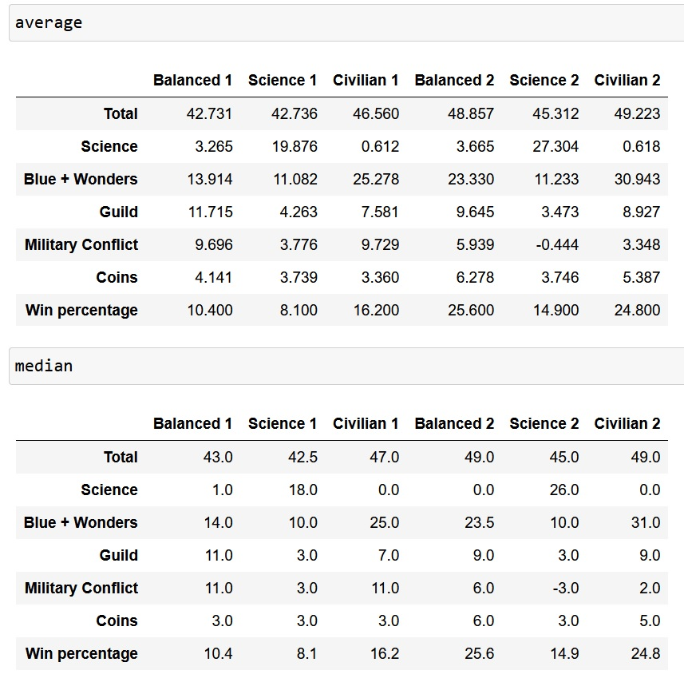
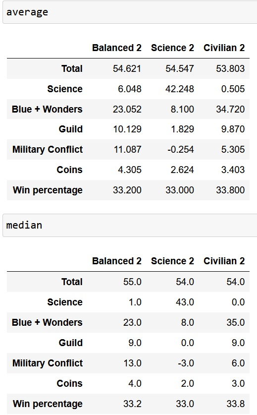

# Training log of Phase 1 (Deep Q Network)

# 3rd Generation

Very little change training-wise from 2nd Generation except that Helicarnassus has now been implemented

Feature input was redesigned to be much more compact, down to 380 features from 484 features.

## Round 1
	- 1024-1024-512 hidden layers
	- 0.0001 lr
	- 1 gamma
	- 80000 iterations (16000 games)
	- Focused make 91% greedy moves. Unfocused make 10% greedy moves.
	- seating 1 focused training player + 2-6 players from [random, training (20% focused)]
	- dq: 
		no extra reward, reward is end game points given at end game only
	- dq_s: 
		half science reward given at build + given again at end (*1.5 science rewards)
	- dq_c: 
		*1.5 civilian+wonder rewards

## Round 2
	- 80000 iterations (16000 games)
	- added a minor MCTS loss update routine to the NN for 2nd-6th move from end game
		(not aiming for results but more for testing MCTS implementation)
		twice each time a game is simulated (every 5 iterations)
		This updates the training player in 1st position only
	- 0.0002 lr for dq optimizer and 0.0001 for mc (0.0001 converged too slowly)
	- Unfocused make 20% greedy moves
	- 1 focused training (used to update MCTS) + 2-6 players from [random, training, and dqx1]

## Round 3
	- 50000 iterations (10000 games)
	- 0.0001 lr for dq optimizer and 0.00003 for mc
	- Unfocused make 30% greedy moves
	- 1 focused training (used to update MCTS) + 2-6 players from [random, training, and dqx2]

## Round 4
	- implemented distributed training (but not used in real training run as it was slower)
	- 100000 iterations (20000 games)
	- increased batch size to 128
	- 0.0001 lr
	- Unfocused make 40% greedy moves
	- 1 focused training + 2-6 players from [random, training, dqx2, dqx3]

## Round 5
	- 80000 iterations (16000 games)
	- decreased batch size to 64
	- 0.00003 lr
	- Unfocused make 50% greedy moves
	- 1 focused training + 2-6 players from [random, training, dqx2, dqx3, dqx4]

below are the results (semi-random has been modified to only random from build choices if available)

# 2nd Generation

After testing the training results extensively with the previous generation,
the DQPlayer and how it is called has been redesigned.

Instead of calling the model only for the card choosing step, 
the model call now combines 'choose' and 'play' steps. The action space size is now 240 instead of 80.

Seeing the previous generation's struggle with science points, 
the code now combines the training of normal player and science-biased player.
The science player obtains double the reward points for any science points scored.

Game.collect() and DQTrainer.gather_batch() now generate batches with 2 different reward regimes.
Both player types are then trained simultaneously using exact same experience with different rewards.

The training loop now also utilizes experience replay, and only plays a new game once every 5 iterations.

## Common paramaters over all rounds

    - 1024-1024-512 hidden nodes (3 layers)
    - Gamma 1.0
    - Batch size 32, 4 batches per iteration. (I'm aware multiple batches per iteration isn't common practice.)
    - New game is played and added to experience cache after every 5 iterations, with the exception of first 10 iterations where a new game is always played.
    - Target model gets updated every 500 iterations (100 games)
    - Focused player takes 90+% greedy actions (90 + 10% of unfocused player greedy moves).

## Round 1 (dq_1 and dq_s_1)

    - Learning rate 0.0003.
    - 4-6 players per game, at least 1 each of each training player as 'focused' player.
    - Each training player seat is buffered by 1-2 other players (which also use training weights, but are all 'unfocused').
    - Unfocused player makes 10% greedy moves.
    - 100000 iterations (20000 games)

## Round 2 (dq_c_1)

    - Learning rate 0.0003.
    - 3-6 players per game, at least one training dq_c_1 player as 'focused' player. The rest are 25% of random, training, dq_1, or dq_s_1 (unfocused).
    - First 2 hidden layers of training player was initialized from dq_1 weights.
    - 25000 iterations (5000 games)

## Round 3 (dq_2, dq_s_2, and dq_c_2)

    - Learning rate 0.00003.
    - 3-6 players per game, 1st seat is focused training player. The rest can be any of 7 choices (random, 1s, or 2s), and has 25% chance to be focused.
    - Unfocused player makes 30% greedy moves.
    - 100000 iterations (20000 games)

## Results between 2 levels and 3 personalities of this generation's players

dq is called 'Balanced', dq_s is called 'Science', and dq_c is called 'Civilian'

First all AIs are pitted against each other in random seating, random wonder, random side (no helicarnassus).
The average of 1000 games of best player is 49.

Second all level 2 AIs are pitted against each other, still random everything as in first setting.
The average of 1000 games of all 3 players is 54+, 
somehow higher than when worse players are in the mix, 
probably because no other player's competing against dq_s_2 (Science 2) for science cards.

# Previous Generation

The Deep Q network was trained over 60000 games, divided into 3 round, 20000 games each.

    - Only the step of choosing a card from the hand was trained.
    - The AI is hard-coded by rule to avoid discarding for 3 coins if at all possible.
    - When there's a choice of building card or building wonder, card is randomly chosen with 70% probability
    - It doesn't matter if the model chose card expecting to play it, it might just end up being used to build a wonder stage

## Common paramaters over all rounds

    - Learning rate 0.0001
    - Gamma 1.0, with rewards only being given at the end of games as final points
    - Target model gets updated every 200 games

## Round 1

    - 2-5 training players + 1 random player, making 3-6 player games
    - For training players, 90% moves are random, 10% moves are greedy

### Round 1 testing
    - Tested by pitting in 3 vs 3 against random players
    - In 500 rounds of alternating seats (0-1-0-1-0-1), Round 1 weights score 10+ points higher than random players
    - In 500 rounds of grouped seats (0-0-0-1-1-1), Round 1 weights score only ~2 points higher.
    - This is probably because actions are 90% random making forward planning moves pointless
		ie. building resource production now doesn't guarantee a building using that resource will be selected in the future,
			so build choices that generate points are favored over resources
    - Science tend to be ignored, since without a focus, science doesn't score well.

## Round 2

    - 2-4 training player + 2 random players, making 4-6 player games, seats are random
    - For training players, 70% moves are random, 30% moves are greedy

### Round 2 testing
    - Tested by pitting in 3 vs 3 against random players
    - In 500 rounds of alternating seats (0-2-0-2-0-2), Round 2 weights score ~7 points higher than random players
    - In 500 rounds of grouped seats (0-0-0-2-2-2), Round 2 weights score 10+ points higher.
    - Apparently 30% determinism was sufficient to teach the model some forward thinking
	- But science still remains ignored

## Round 3

    - 2-4 training players + 1-2 frozen players, making 3-6 player games, seats are random
    - Frozen players have equal chance of being random, round 1, or round 2.
    - Non-random players have 50% chance to be focused player, 50% to be unfocused player.
    - Focused players make 90% greedy moves and 10% random moves
    - Unfocused players make 30% greedy moves and 70% random moves

### Round 3 testing
    - The model still doesn't seem to have figured out how to play science

#### Test 1
    - Player 0-1-2-3 are pitted against each other in completely random matchups
    - Number of players can be 3-6. Each player can be any of 0-1-2-3.
    - Average scores over 1000 games are 32.38802083, 39.83902878, 41.2962963, 45.33717835

#### Test 2
    - Player 0-1-2-3 are pitted against each other in 4 player games, with exactly 1 type of player each
    - Average scores over 1000 games are 30.755, 38.689, 42.146, 46.558

#### Test 3
    - Player 3 is pitted in 1 vs many games against any number of 0s for 300 rounds, then 1s for 300 rounds, then 2s
    - 3 vs 0s: 51.45 vs 34.36
	- 3 vs 1s: 45.94 vs 38.45
	- 3 vs 2s: 44.66 vs 39.53

## Potential improvements (of Previous Generation)

    - Model for 'play' step (card-wonder-discard)
    - Somehow have to make the model figure out how to play science. Rewards probably need to be redesigned for that purpose.
    - Potentially rewards could be given at each step instead of all at once at the end, but the step function will need to be reworked.

    
    

