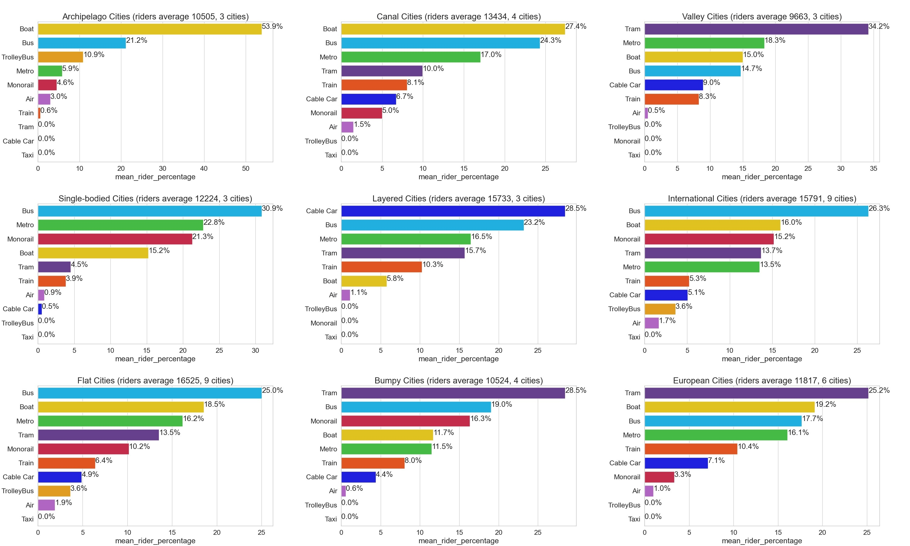
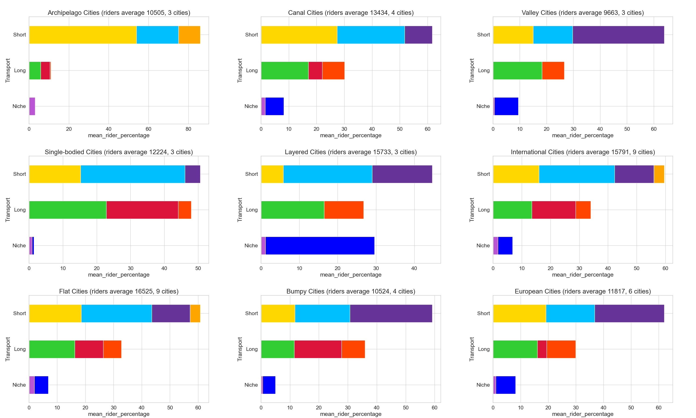

### About Cities Skylines transport ridership

This is a simple data visualization project.

The data are public transport ridership of different cities created in Cities Skylines.

Examples of the data used are the attached Sebascodegan.jpg and Shuangbashi.jpg

This is then input into the text file *files/data.txt*. 
(by hand, no OCR used) The text file was designed in a simple format just in case other city builders may be tempted to share their data they can do so in the same format.

```
'1715,0,6568,6031,547,20,74,0,0,0,14955,502000,25','flat,international'#Shuangbashi
'476,0,1104,2610,1330,176,606,0,0,0,6302,502000,25'

'3711,0,0,1988,77,4559,83,1617,0,0,12035,383000,25','archipelago,bumpy,canal,european'#Sebascodegan
'631,0,0,664,185,842,257,441,0,0,3020,383000,25'

'891,0,3377,0,1379,2944,0,0,0,0,8591,100000,25','valley,canal,european'#Sumpftal
'61,0,288,0,361,194,20,0,0,0,924,100000,25'
```

Then it's just a simple visualization either using *Seaborn* itself or using *pandas*' own plot with *Seaborn* style.
Bar colors are hard-coded to match the color used in game. (again, see Sebascodegan.jpg for the color code)

Plots are generated individually before being stitched simply with *numpy.concatenate()*.

The combined plot results are included in the repository.



