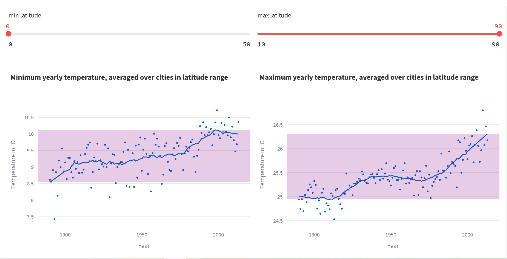
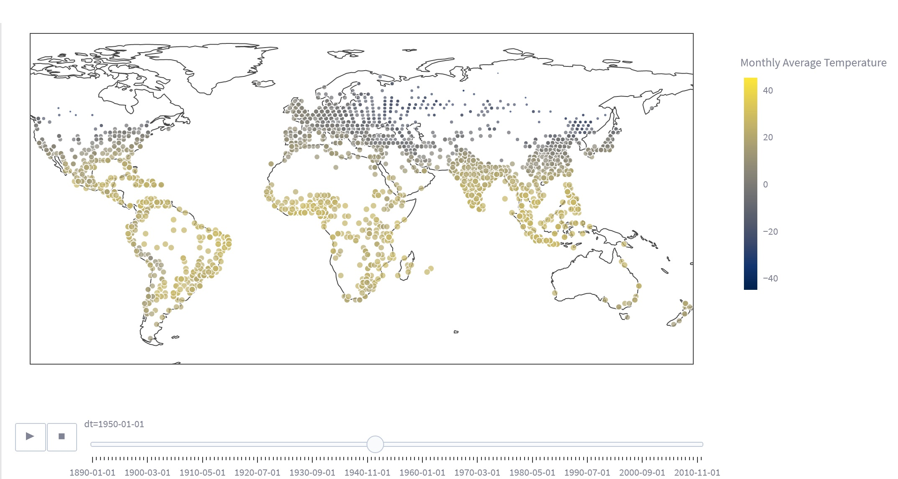

### Earth Surface Temperature

This is a spin-off from Geospatial project. 

I intended to add interactive dashboards of business data to my portfolio, but it turned out climate data is more readily available than business data, so this was done first.

To use the dashboard app:

1. With or withour virtualenv, install requirements with ```pip install -r requirements.txt```
   
2. Either manually download earth surface temperature data from [kaggle](https://www.kaggle.com/datasets/berkeleyearth/climate-change-earth-surface-temperature-data), extracting the files to sub ```/earth_surface_temperature``` folder.
    
OR
   
    Setup your own kaggle API (For Windows, you'll have to save ```kaggle.json``` into ```.kaggle``` folder inside your user folder), then use the ```Load from Kaggle``` checkbox inside the app.
       
3. Run ```streamlit run earth_surface_temperature.py``` after installing the requirements

Alternatively, the cloud app, without the map can be found [here](https://berkeley-data-earth-temperature.streamlit.app/)

(the map exceeds cloud memory limit)

#### Preview images




