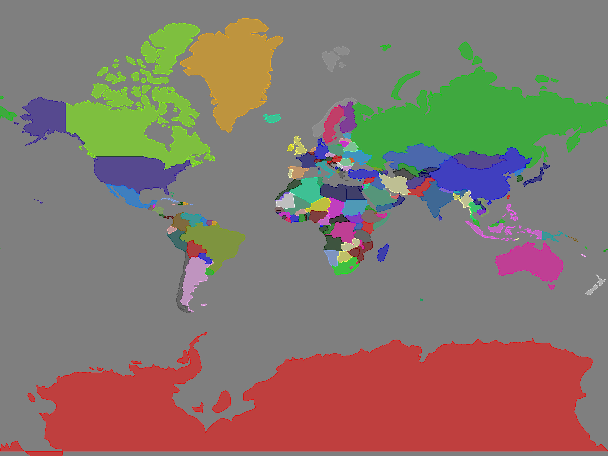
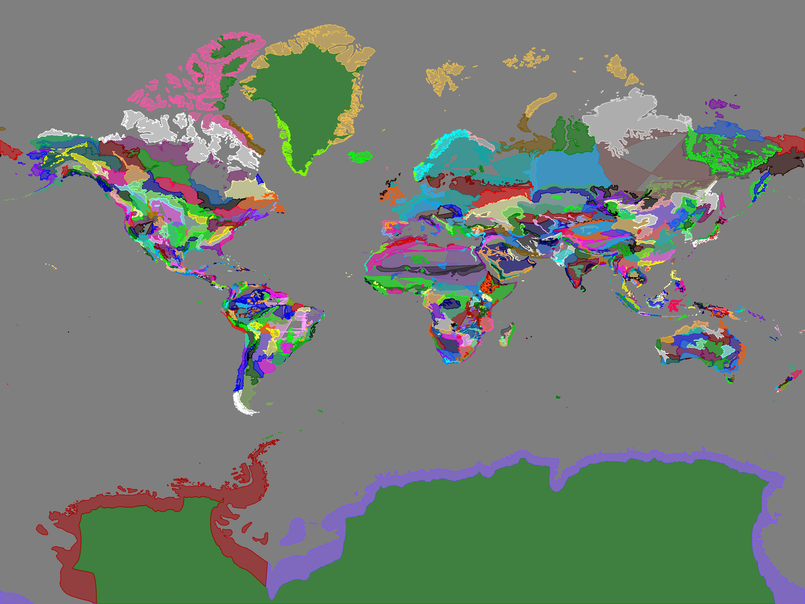

### About the geospatial project

This is an in-development geospatial project. I'm just experimenting with things, and looking for data to do some geospatial data science stuff.

Currently I've managed to draw map of Earth's countries with data from
[kaggle country state geojson](https://www.kaggle.com/datasets/chapagain/country-state-geo-location)

And also map of Earth's ecoregions with data from
[data basin terrestrial ecoregions](https://databasin.org/datasets/68635d7c77f1475f9b6c1d1dbe0a4c4c/)

The results are as follows

