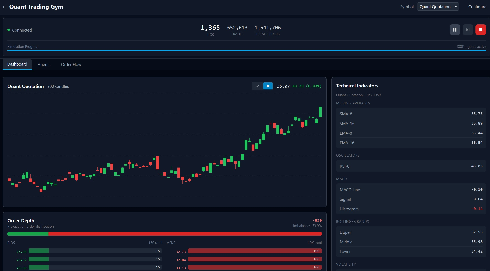

# Quant Trading Gym

### Keywords
*Extracted by GitHub Copilot*

- **Language:** `Rust` · `TypeScript` · `Python`
- **Architecture & Patterns:** `Trait-Based Polymorphism` · `Separation of Concerns (SoC)` · `Plugin Architecture` · `Tick-Based Event Loop` · `Strategy Pattern` · `Builder Pattern (Config structs)` · `Dependency Injection via Traits` · `Layered Architecture` · `Agent Trait Interface` · `Context Object Pattern` · `Command Pattern (AgentAction)` · `Hook Pattern (SimulationHook)`
- **Market Simulation:** `Trading Simulation` · `Order Book` · `Limit Order Book (LOB)` · `Matching Engine` · `Price-Time Priority` · `Market Microstructure` · `Slippage Modeling` · `Batch Auction` · `Clearing Price Algorithm`
- **Quantitative Finance:** `Technical Indicators (SMA, EMA, RSI, MACD, Bollinger Bands, ATR)` · `Risk Metrics (VaR, Sharpe Ratio, Sortino Ratio, Max Drawdown)` · `VWAP Execution` · `Market Making` · `Bid-Ask Spread` · `Inventory Management` · `Fair Value Models` · `Gordon Growth Model` · `Random Walk` · `Pairs Trading` · `Statistical Arbitrage`
- **Machine Learning:** `Decision Tree` · `Random Forest` · `Gradient Boosted Trees` · `Scikit-learn` · `Feature Engineering` · `SHAP Feature Selection` · `Training-Serving Parity` · `JSON Model Export` · `Polars` · `Ensemble Learning` · `Linear Models (Logistic Regression)` · `Support Vector Machines (SVM)` · `Feature Extractor Traits` · `Semantic Neutral Values` · `Imputation Strategies`
- **Agent Architecture:** `Reinforcement Learning` · `Tiered Agent Architecture` · `Multi-Agent Systems` · `Event-Driven Architecture` · `Reactive Agents (Wake Conditions)` · `Background Liquidity Pool`
- **Web & Real-Time:** `Axum 0.8` · `WebSocket` · `REST API` · `React 19` · `Vite 6` · `Tailwind CSS` · `Real-Time Dashboard` · `Tower HTTP` · `CORS` · `Recharts` · `React Query (TanStack)`
- **Rust Ecosystem:** `Cargo Workspaces` · `Modular Crate Design` · `Tokio (Async Runtime)` · `TUI (Ratatui/Crossterm)` · `Rayon (Parallel Iterators)` · `Serde` · `rusqlite` · `clap (CLI)` · `tracing` · `Apache Arrow` · `PyO3 Python Bindings` · `Maturin` · `NumPy Arrays` · `GIL Release` · `SmallVec`
- **Performance:** `High-Performance Computing` · `Fixed-Point Arithmetic` · `Financial Precision (i64)` · `Rolling Windows` · `Statistical Analysis` · `Parallel Execution` · `Two-Phase Tick Architecture`
- **Persistence & DevOps:** `SQLite` · `Apache Parquet` · `OHLCV Candle Aggregation` · `Time-Series Data` · `Docker` · `Docker Compose` · `Distroless Containers` · `Headless Mode` · `CLI Configuration`

---

## Project Overview

Quant Trading Gym is a high-performance quantitative trading simulation platform built primarily in Rust. It is designed to support large-scale simulations with over 100,000 agents using a tiered architecture. The system integrates Reinforcement Learning (RL) training capabilities, modular quantitative strategies, risk management, and a microservices architecture.

In this project, I try to push the boundaries of AI-assisted development.

- [Executive Summary](docs/executive_summary.md)
- [Technical Summary](docs/technical_summary.md)
- `q` to quit, `spacebar` to toggle simulation.
- **VWAP Executor**: Currently configured as a buyer accumulating 1000 shares. This is an *execution algorithm*, not a *strategy*. Future iterations will consider what the current agents should become.

## Getting Started

- `cargo build --release`
- `cargo run --release`
- `q` to quit application.

## Development Roadmap

The project is built vertically in iterative stages, ensuring a runnable simulation at each step.

- **[Development log](development_log.md)**
- **[Project plan vertical](project_plan_vertical.md)**
- **[Project plan initial](project_plan_initial.md)**

| Version | Focus | Goal |
|---------|-------|------|
| **V0** (completed) | **MVP Simulation** | Single-threaded simulation with TUI visualization showing agents trading. |
| **V1** (completed) | **Quant Strategy Agents** | Add indicators (SMA, RSI), risk metrics (Sharpe, Drawdown), and real strategies. |
| **V2** (completed) | **Market Realism & Events** | Implement multi-symbol and random events. |
| **V3** (completed) | **Persistence & Agent Scaling** | SQLite for trade history and tiered architecture for 100k+ agent scale. |
| **V4** (completed) | **Web frontend** | Axum and React TS Frontend with Dashboard |
| **V5** (completed) | **Machine Learning** | Training for traditional ML. |
| **V6** (completed) | **Feature Engineering** | SHAP feature selection, ensemble models, 28 canonical features. |
| **V7** | **Reinforcement Learning** | Gym environment (V7.1), RL training with PPO/A2C (V7.2). |
| **V8** | **Portfolio manager game** | Services, API for portfolio manager game. |

## Key Features

- **High Performance:** Built with Rust for core simulation and services, ensuring low latency and high throughput.
- **Scalability:** Supports 100,000+ agents through a tiered architecture:
  - **Tier 1 (Smart):** Full strategy agents (e.g., RL agents, complex quant strategies).
  - **Tier 2 (Reactive):** Event-triggered agents with lightweight logic.
  - **Tier 3 (Background):** Statistically modeled background liquidity pool.
- **RL Integration:** Python bindings for training scripts and experiments.
- **Financial Precision:** Uses fixed-point arithmetic (`i64`) for all monetary values to ensure accuracy.
- **Modular Design:** Strategies, observations, and rewards are implemented as plugins.
- **Microservices:** Async services for non-critical paths, bridged to the synchronous simulation core.

## Guiding Mantra

> **"Declarative, Modular, SoC"**

| Principle | Meaning |
|-----------|----------|
| **Declarative** | Describe *what*, not *how*. Config over code. Data-driven behavior. |
| **Modular** | Components are self-contained, swappable, and independently testable. |
| **SoC** | Separation of Concerns — each module has ONE job. No god objects. |

## Architecture

The project follows a strict separation of concerns where crates communicate through traits. It is designed to fit within a 2GB memory budget while maintaining realistic latency and order execution.

### Crate Responsibilities (SoC)

| Crate | Single Responsibility |
|-------|----------------------|
| `types` | Shared data structures (Order, Trade, Price, Config) — no logic |
| `sim-core` | Order book and matching engine — market mechanics only |
| `agents` | Agent trait and strategies — behavior interface only |
| `news` | Event generation and fundamentals — market events only |
| `quant` | Indicators and risk metrics — quantitative analysis only |
| `simulation` | Tick loop orchestration — coordination only |
| `parallel` | Parallel/sequential execution — Rayon abstraction only |
| `storage` | SQLite persistence and Parquet export — data recording only |
| `tui` | Terminal UI visualization — presentation only |
| `server` | REST/WebSocket API — async web interface only |

## Tech Stack

- **Rust:** Core simulation, types, quant strategies, and services.
- **Python:** Training scripts and experiments (via PyO3).
- **TypeScript:** Frontend interface.

