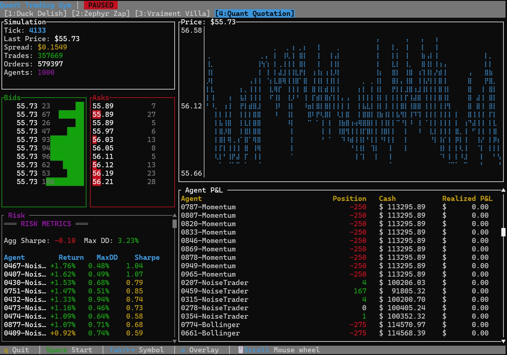

# Quant Trading Gym

## Project Overview

Quant Trading Gym is a high-performance quantitative trading simulation platform built primarily in Rust. It is designed to support large-scale simulations with over 100,000 agents using a tiered architecture. The system integrates Reinforcement Learning (RL) training capabilities, modular quantitative strategies, risk management, and a microservices architecture.

In this project, I try to push the boundaries of AI-assisted development.

- [Executive Summary](docs/executive_summary.md)
- [Technical Summary](docs/technical_summary.md)
- `q` to quit, `spacebar` to toggle simulation.
- **VWAP Executor**: Currently configured as a buyer accumulating 1000 shares. This is an *execution algorithm*, not a *strategy*. Future iterations will consider what the current agents should become.

## Getting Started

- `cargo build --release`
- `cargo run --release`
- `q` to quit application.

## Development Roadmap

The project is built vertically in iterative stages, ensuring a runnable simulation at each step.

**[Development log](development_log.md)**

| Version | Focus | Goal |
|---------|-------|------|
| **V0** (completed) | **MVP Simulation** | Single-threaded simulation with TUI visualization showing agents trading. |
| **V1** (completed) | **Quant Strategy Agents** | Add indicators (SMA, RSI), risk metrics (Sharpe, Drawdown), and real strategies. |
| **V2** (completed) | **Market Realism & Events** | Implement tiered architecture (Smart, Reactive, Background) for 100k+ agent scale. |
| **V3** | **Persistence & Agent Scaling** | Add SQLite storage for trade history and news event generation. |
| **V4** | **RL or Game Track** | **RL:** Gym env, PyO3 bindings, training.   **Game:** Services, API, Web Frontend. |
| **V5** | **Full Integration** | RL agents as opponents in the multiplayer game. |

## Key Features

- **High Performance:** Built with Rust for core simulation and services, ensuring low latency and high throughput.
- **Scalability:** Supports 100,000+ agents through a tiered architecture:
  - **Tier 1 (Smart):** Full strategy agents (e.g., RL agents, complex quant strategies).
  - **Tier 2 (Reactive):** Event-triggered agents with lightweight logic.
  - **Tier 3 (Background):** Statistically modeled background liquidity pool.
- **RL Integration:** Python bindings for training scripts and experiments.
- **Financial Precision:** Uses fixed-point arithmetic (`i64`) for all monetary values to ensure accuracy.
- **Modular Design:** Strategies, observations, and rewards are implemented as plugins.
- **Microservices:** Async services for non-critical paths, bridged to the synchronous simulation core.

## Guiding Mantra

> **"Declarative, Modular, SoC"**

| Principle | Meaning |
|-----------|----------|
| **Declarative** | Describe *what*, not *how*. Config over code. Data-driven behavior. |
| **Modular** | Components are self-contained, swappable, and independently testable. |
| **SoC** | Separation of Concerns — each module has ONE job. No god objects. |

## Architecture

The project follows a strict separation of concerns where crates communicate through traits. It is designed to fit within a 2GB memory budget while maintaining realistic latency and order execution.

### Crate Responsibilities (SoC)

| Crate | Single Responsibility |
|-------|----------------------|
| `types` | Shared data structures (Order, Trade, Price) — no logic |
| `sim-core` | Order book and matching engine — market mechanics only |
| `agents` | Agent trait and market data — behavior interface only |
| `simulation` | Tick loop orchestration — coordination only |

## Tech Stack

- **Rust:** Core simulation, types, quant strategies, and services.
- **Python:** Training scripts and experiments (via PyO3).
- **TypeScript:** Frontend interface.

